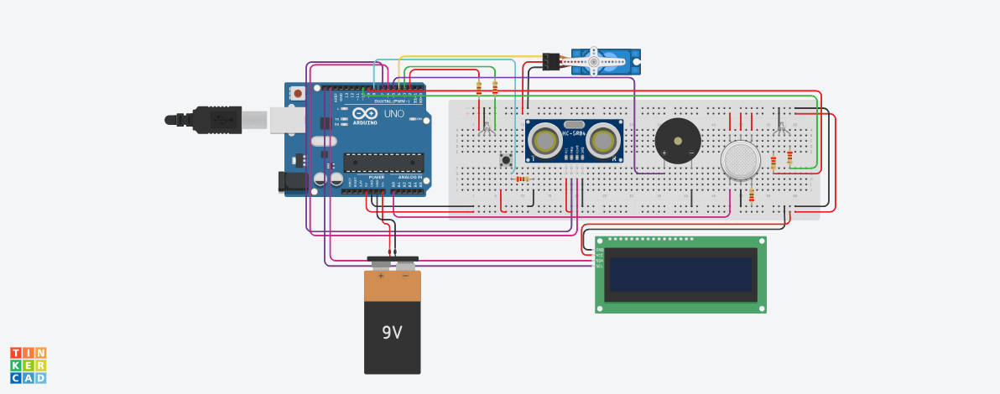
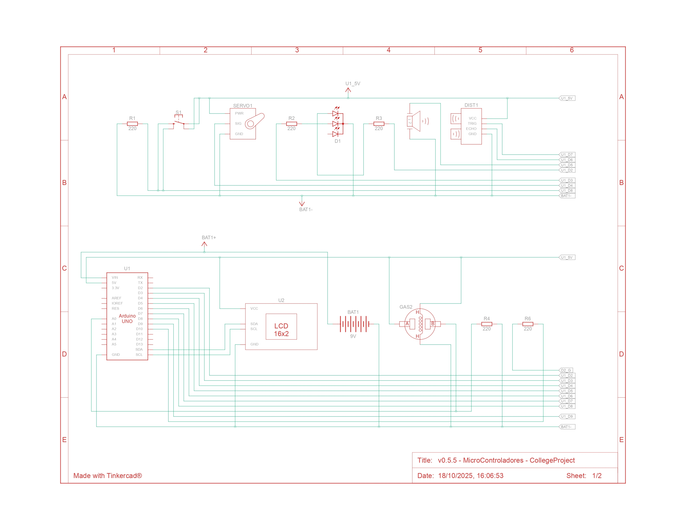
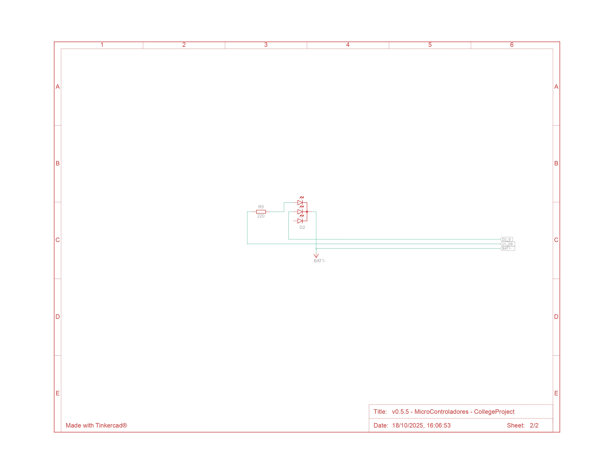

# 🗑️ Lixeira Inteligente com Arduino, Sensor de Gás e Contador de Sacolas

Este projeto implementa uma lixeira inteligente automatizada que utiliza um sensor ultrassônico para abertura automática e um controle manual com botão para monitorar o descarte de sacolas (ou ciclos de abertura manual) em um display LCD. 

_Atualização: **A nova versão v0.5.5 inclui um sensor de gás para monitorar a qualidade do ar interno da lixeira.**_

* _Versão atual: [v0.5.5](https://www.tinkercad.com/things/idXBpOgxGqu-v05-microcontroladores-collegeproject?sharecode=YX1g0w7n339c5irUJk7A5dMIvdltABh9mT0SGikLEVY)_

## 🚀 Funcionalidades

* **Abertura Automática:** O servo motor abre a tampa da lixeira quando um objeto (lixo) é detectado a uma distância inferior a **$20 \text{ cm}$**. A tampa fecha automaticamente após $3$ segundos.
* **Controle Manual:** Um botão permite abrir ou fechar o servo motor manualmente.
* **Contador de Sacolas (ou Descartes):** O contador é incrementado *apenas* quando o modo manual é **ativado** (transição de FECHADO para ABERTO), permitindo registrar a frequência de descarte.
* **Monitoramento de Gás:** Um sensor analógico ($A0$) mede o nível de gás, indicando a qualidade do ar interno da lixeira.
    * **Bandeira Verde/Bom:** Nível de gás baixo ($< 21$).
    * **Bandeira Amarela/Atenção:** Nível de gás médio ($21$ a $29$).
    * **Bandeira Vermelha/Perigo:** Nível de gás alto ($\ge 30$).
* **Indicação de Estado (LEDs):**
    * **LED Verde (Sistema):** Sistema em modo automático (normal).
    * **LED Vermelho (Sistema):** Sistema em modo manual (aberto pelo botão).
    * **LEDs Gás (Verde e Vermelho):** Indicam o nível de gás (Verde, Amarelo, Vermelho).
* **Display LCD:** Exibe uma mensagem de inicialização e o total de "Sacolas da semana".
* **Buzzer:** (Componente adicionado ao hardware, mas não usado no controle de gás) O pino $D5$ foi reservado para um Buzzer Piezo, que pode ser usado para alertas.

## 🛠️ Componentes Necessários

| Componente | Quantidade | Função |
| :--- | :--- | :--- |
| Arduino (Uno, Nano, etc.) | 1 | Microcontrolador principal. |
| Servo Motor (e.g., SG90) | 1 | Controla a abertura/fechamento da tampa. |
| Sensor Ultrassônico (HC-SR04) | 1 | Mede a distância para detecção automática. |
| **Sensor de Gás (Analógico)** | **1** | **Mede a concentração de gases (e.g., MQ-2, MQ-3).** |
| Display LCD (16x2) | 1 | Exibe o contador de sacolas e status. |
| Botão Push-Button | 1 | Para controle manual e contagem. |
| LED Vermelho (Sistema) | 1 | Indica modo manual. |
| LED Verde (Sistema) | 1 | Indica modo automático. |
| **LED Vermelho (Gás)** | **1** | **Indica perigo de gás.** |
| **LED Verde (Gás)** | **1** | **Indica ar limpo/bom nível de gás.** |
| **Buzzer Piezo** | **1** | **Para alertas sonoros.** |
| Resistores | Vários | Para os LEDs e, se necessário, o sensor de gás. |
| Jumpers (Fios) | Vários | Conexões entre os componentes. |

## 📌 Esquema de Conexão (Pinagem)

| Componente | Pino do Arduino | Função |
| :--- | :--- | :--- |
| **Sensor de Gás (Analógico)** | A0 | Entrada analógica do sensor de gás. |
| **LED Vermelho (Sistema)** | D2 | Indica modo manual. |
| **LED Verde (Sistema)** | D3 | Indica modo automático. |
| **Servo Motor - Sinal** | D4 | Controle de posição. |
| **Buzzer Piezo** | D5 | Saída para controle do Buzzer. |
| **Sensor Ultrassônico - Echo** | D6 | Recebe o pulso (medida de tempo). |
| **Sensor Ultrassônico - Trigger** | D7 | Envia o pulso. |
| **Botão (com PULL-UP)** | D8 | Ativa/Desativa o modo manual. |
| **LED Vermelho (Gás)** | D9 | Indica perigo de gás. |
| **LED Verde (Gás)** | D10 | Indica ar limpo/bom nível de gás. |
| **Display LCD** | (Endereçamento/Pinos) | Exibição de dados. |

***Nota sobre o Botão:*** *O botão está configurado como `INPUT_PULLUP`, o que significa que ele deve ser conectado entre o Pino D8 e o **GND** (Terra). O resistor de pull-up é interno, simplificando a fiação.*

## 🖼️ Esquema de Montagem do código atual
#### Vista de Circuito:

#### Vista esquemática:
página 1:

página 2:

## ⚙️ Bibliotecas Necessárias

Certifique-se de que as seguintes bibliotecas estão instaladas no seu IDE do Arduino:

1.  **`Servo.h`**: (pré-instalada no IDE do Arduino)
2.  **`Adafruit_LiquidCrystal.h`**: (Instalar via Gerenciador de Bibliotecas. O construtor `lcd(0)` é usado, que é comum para displays conectados diretamente ou com certas configurações de barramento.)

## 💻 Detalhes do Código

O código está estruturado com as seguintes funções principais:

| Função | Descrição |
| :--- | :--- |
| `setup()` | Inicializa a comunicação serial, o LCD, os pinos (incluindo os novos LEDs de Gás e Buzzer) e define o servo para $0^\circ$ (fechado). |
| `loop()` | Ciclo principal: lida com o botão, lê a distância e o gás, controla o servo e atualiza o display/LEDs. |
| `readDistanceCm()` | Executa a rotina do HC-SR04 e retorna a distância em centímetros. |
| `handleButtonPress()` | Implementa a detecção de borda e alterna o estado manual (`g_servoManuallyOpen`). Incrementa o contador *apenas* na transição de fechado para aberto. |
| `controlServo()` | Implementa a lógica: se a distância for $\le \mathbf{20 \text{ cm}}$ (limite do código), abre/espera/fecha (ciclo automático). Caso contrário, segue o estado manual. |
| `controlSystemLED()` | Define os estados dos LEDs do sistema (Verde/Vermelho) com base em `g_servoManuallyOpen`. |
| **`controlGas()`** | **Lê o sensor A0, classifica o nível de gás (1=Bom, 2=Atenção, 3=Perigo) e retorna a bandeira.** |
| **`controlGasLED()`** | **Define os estados dos LEDs de Gás (Verde/Vermelho) com base na bandeira retornada por `controlGas()`.** |
| `inicializarPinos()` | Configura todos os pinos de saída (LEDs, Servo, Buzzer) e de entrada (Botão). |